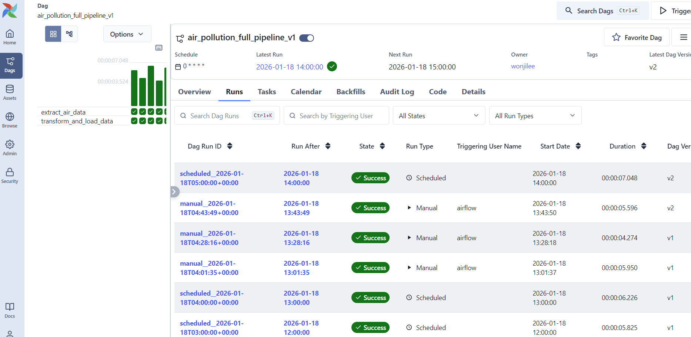
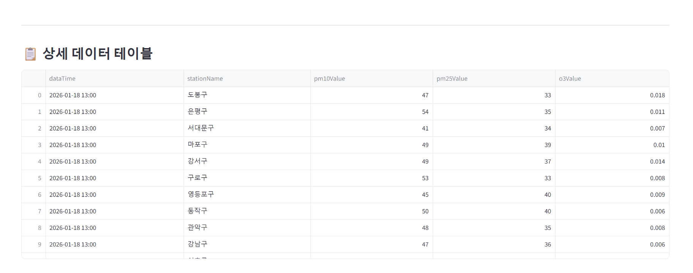
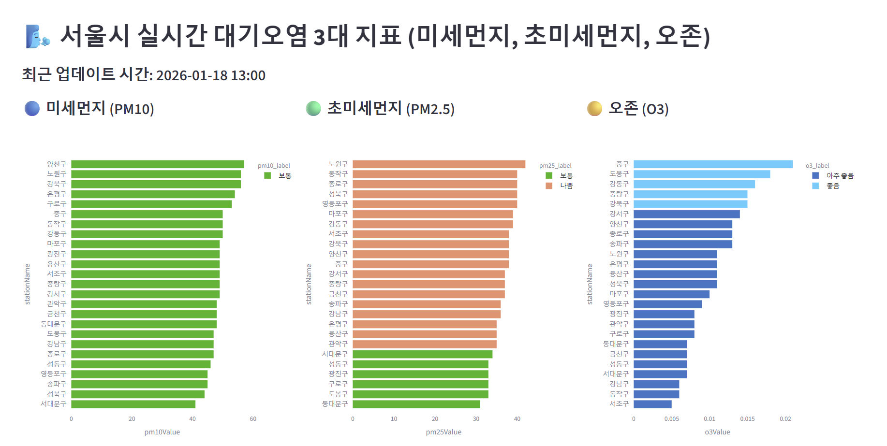
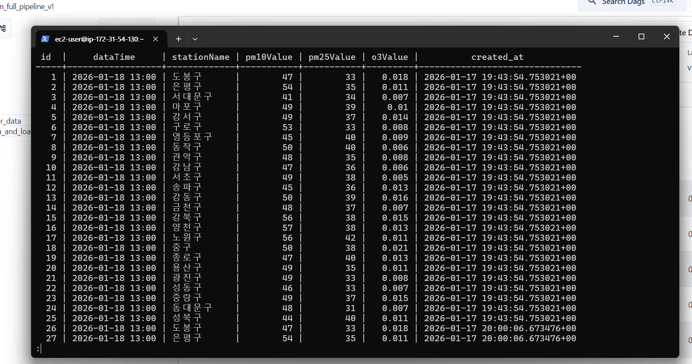

# 🌬️ Seoul Real-time Air Quality Data Pipeline (End-to-End)

This project demonstrates a professional-grade data engineering pipeline. It automates the collection of air quality data, ensures its persistence in a data lake and warehouse, and provides real-time insights through an automated dashboard and alerting system.

---

## 🏗️ Architecture & Data Flow

1.  **Extract:** Hourly ingestion from Air Korea API.
2.  **Storage (Bronze):** Raw JSON data is archived in **AWS S3** for durability.
3.  **Transform:** Data cleansing, filtering for 25 districts, and KST timezone conversion via **Pandas**.
4.  **Load (Silver):** Refined data is stored in **PostgreSQL** for analysis.
5.  **Visualize:** Live reporting on a **Streamlit** dashboard.
6.  **Alert:** Immediate **Slack** notifications for hazardous air quality levels.

---

## 🛠️ Tech Stack

| Category | Technology |
| :--- | :--- |
| **Cloud & Infra** | AWS EC2, Docker, Docker Hub |
| **Orchestration** | Apache Airflow |
| **Storage** | AWS S3, PostgreSQL |
| **DevOps (CI/CD)** | GitHub Actions |
| **Monitoring** | Slack API (Webhooks) |
| **Data Logic** | Python (Pandas, SQLAlchemy) |

---

## 🚀 Key Engineering Features

### ✅ Automated CI/CD Pipeline
Implemented **GitHub Actions** to eliminate manual deployments. 
- **CI:** Automated Docker builds and pushes to Docker Hub on every code change.
- **CD:** Automated deployment to AWS EC2 via SSH, ensuring the latest dashboard version is always live.

### ✅ Professional Secret Management
- Zero exposure of sensitive keys in the repository.
- Utilized **GitHub Secrets** and **Environment Variables (`.env`)** to manage API keys, Slack Webhooks, and DB credentials.
- Strict **`.gitignore`** policies maintained to protect local configuration files.

### ✅ Intelligent Monitoring
- Configured real-time alerting using **Slack Incoming Webhooks**.
- The system automatically detects PM10 levels exceeding safety thresholds (>150µg/m³) and notifies the administrator immediately.

---

## 📊 Dashboard Preview
The dashboard features horizontal bar charts for optimal readability of Seoul's 25 districts, color-coded by air quality standards.

---

## 🔧 Installation & Setup

1. **Clone the Repo:** `git clone https://github.com/w1024ji/air-quality-project.git`
2. **Setup Secrets:** Add `AIR_API_KEY`, `SLACK_WEBHOOK_URL`, etc., to GitHub Secrets.
3. **Deploy:** Push to `main` branch to trigger the automated deployment.

---

### 💡 Future Roadmap
- [ ] Add geospatial mapping (Mapbox/Folium) for Seoul air quality.
- [ ] Implement incremental loading logic for database optimization.
- [ ] Create a weekly statistical report using SQL window functions.

