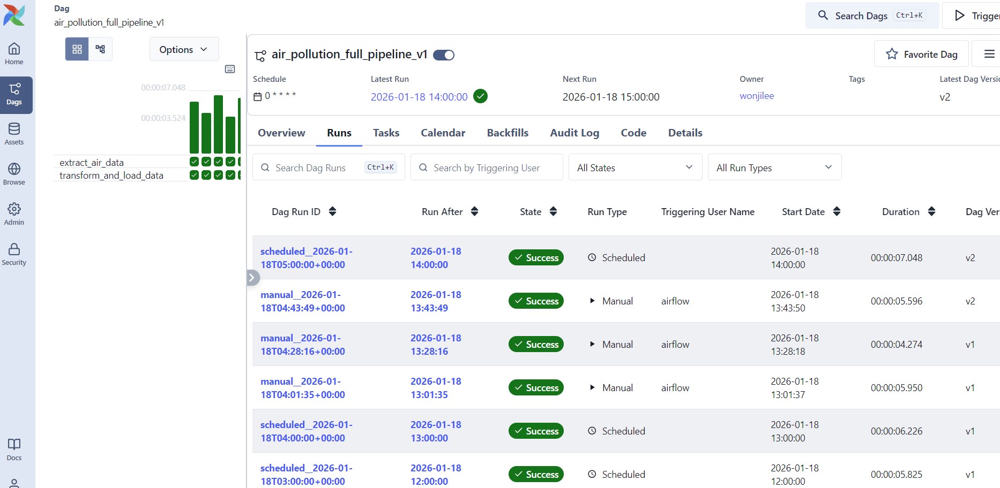
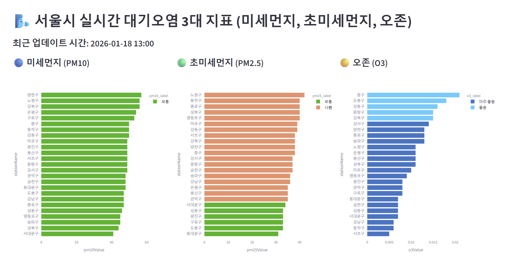
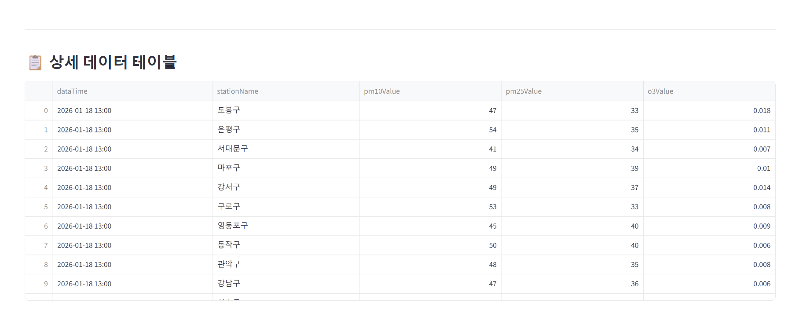

# 🌬️ Seoul Real-time Air Quality Data Pipeline

---

## 🇰🇷 프로젝트 개요 (Korean Summary)

이 프로젝트는 서울시 대기질 데이터를 실시간으로 수집, 처리, 시각화하고, 위험 수치를 감지하여 알림을 제공하는 데이터 파이프라인 시스템입니다.

Airflow, AWS S3, PostgreSQL을 활용하여 end-to-end 데이터 흐름을 구축했으며, Streamlit을 통해 실시간 대시보드를 제공하고 Slack을 통해 이상 상황을 즉시 알림 받을 수 있도록 설계했습니다.

또한 Docker와 GitHub Actions를 활용하여 CI/CD 환경을 구축함으로써 자동 배포가 가능한 시스템을 구현했습니다.

### 💡 주요 결과

* 서울 지역별 미세먼지 농도 차이 및 패턴 분석 가능
* 실시간 모니터링 및 자동 알림 시스템 구축
* CI/CD 기반의 안정적인 운영 환경 구현

이 프로젝트는 데이터 수집부터 활용까지 이어지는 전체 흐름을 자동화한 실무형 데이터 엔지니어링 프로젝트입니다.

---

## ❓ Problem

How can we monitor and respond to real-time air pollution effectively?

Air quality data is publicly available, but it is often fragmented, delayed, and difficult to act upon.
This project addresses the challenge of building a system that continuously collects, processes, and delivers real-time air quality insights in an actionable way.

---

## 🎯 Goal

* Build an end-to-end data pipeline for real-time air quality monitoring
* Ensure reliable data ingestion and storage
* Enable real-time visualization and alerting
* Automate deployment and system updates through CI/CD

---

## 💡 Key Insights

* Identified **district-level variations** in air pollution across Seoul
* Detected **recurring peak pollution patterns** at specific times
* Enabled **real-time alerting** for hazardous air quality conditions
* Demonstrated how automated pipelines can support **fast decision-making**

---

## 🏗️ Architecture Overview

This project implements a production-like data pipeline:

* **Orchestration**: Apache Airflow
* **Processing**: Python (Pandas)
* **Storage**: AWS S3 (Data Lake), PostgreSQL (Data Warehouse)
* **Visualization**: Streamlit Dashboard
* **Monitoring**: Slack Alerts
* **Deployment**: Docker + GitHub Actions (CI/CD)

---

## ⚙️ Data Flow

1. **Extract**

   * Hourly ingestion from Air Korea API

2. **Storage (Bronze Layer)**

   * Raw JSON data stored in AWS S3

3. **Transform**

   * Data cleansing and filtering (25 districts)
   * Timezone normalization (KST)

4. **Load (Silver Layer)**

   * Processed data stored in PostgreSQL

5. **Visualize**

   * Real-time dashboard via Streamlit

6. **Alert**

   * Slack notifications triggered when PM10 exceeds threshold

---

## 🚀 Key Engineering Features

### ✅ Automated CI/CD Pipeline

* Implemented GitHub Actions for automated build & deployment
* Docker image is built and pushed on every code change
* Automatic deployment to EC2 ensures the latest version is always running

👉 Eliminated manual deployment and improved system reliability

---

### ✅ Real-time Monitoring & Alerting

* Integrated Slack Webhooks for instant alerts
* Triggered notifications when PM10 > 150µg/m³

👉 Enables immediate response to hazardous conditions

---

### ✅ Secure Configuration Management

* Managed secrets using GitHub Secrets and environment variables
* Prevented exposure of API keys and credentials
* Maintained strict `.gitignore` policy

---

## 📊 Dashboard

The dashboard visualizes:

* PM10 (Fine Dust)
* PM2.5 (Ultra Fine Dust)
* Ozone levels

👉 Features:

* District-level comparison
* Color-coded air quality indicators
* Real-time updates

---

## 💡 Why This Project Matters

This project demonstrates how data engineering systems can:

* Transform raw public data into actionable insights
* Support real-time monitoring and decision making
* Improve reliability through automation and CI/CD

It highlights the importance of not only building pipelines, but also ensuring they are **scalable, maintainable, and production-ready**.

---

## 🛠 Tech Stack

* **Language**: Python
* **Data Processing**: Pandas, SQLAlchemy
* **Data Engineering**: Airflow, AWS S3, PostgreSQL
* **DevOps**: Docker, GitHub Actions
* **Monitoring**: Slack API

---

## 🔮 Future Improvements

* Add geospatial visualization (Map-based dashboard)
* Implement incremental data loading
* Introduce anomaly detection for pollution spikes
* Extend pipeline to multi-city analysis

---

## 🧩 Takeaway

👉 A good data pipeline is not just about moving data.

This project shows how automation, monitoring, and reliable infrastructure can turn raw data into a system that enables real-time awareness and action.

